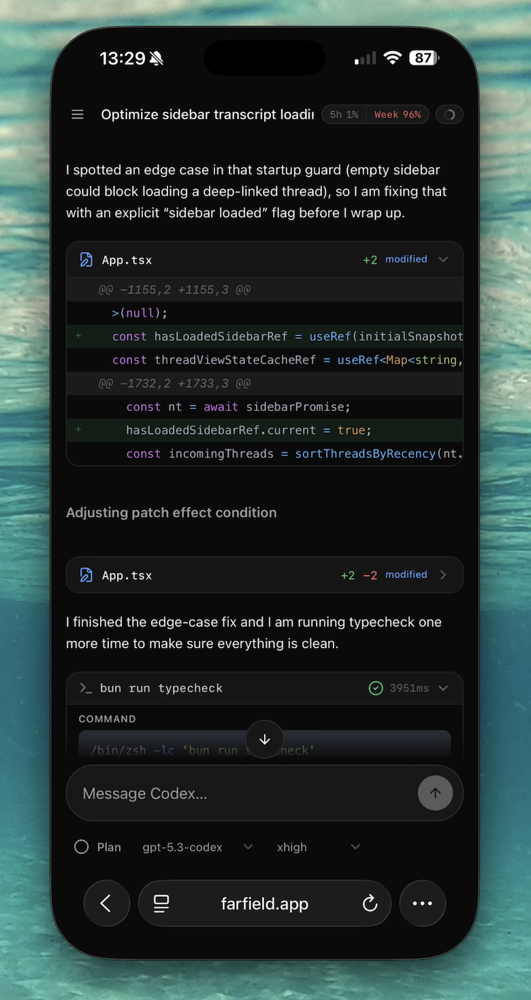

# Farfield

Remote control for AI coding agents — read conversations, send messages, switch models, and monitor agent activity from a clean web UI.

Supports [Codex](https://openai.com/codex) and [OpenCode](https://opencode.ai).

Built by [@anshuchimala](https://x.com/anshuchimala).

This is an independent project and is not affiliated with, endorsed by, or sponsored by OpenAI or the OpenCode team.

[](https://buymeacoffee.com/achimalap)



## Features

- Thread browser grouped by project
- Chat view with model/reasoning controls
- Plan mode toggle
- Live agent monitoring and interrupts
- Debug tab with full IPC history

## Quick start (recommended)

You can run the Farfield server locally, then use the hosted frontend at [farfield.app](https://farfield.app). This is always updated with the latest features, and saves you the trouble of hosting it yourself. You still need to expose the server securely, however, for remote access. We cover how to do this with Tailscale below, as a simple option.

```bash
bun install
bun run server
```

`bun run server` runs only the backend on `0.0.0.0:4311`.

If you need to pick agent providers:

```bash
bun run server -- --agents=opencode
bun run server -- --agents=codex,opencode
bun run server -- --agents=all
```

> **Warning:** This exposes the Farfield server on your network. Only use on trusted networks. See below for how to configure Tailscale as a VPN for secure remote access.

## Local development and self-hosted frontend

Use this if you are working on Farfield itself, or if you want to run both frontend and backend locally.

```bash
bun install
bun run dev
```

Opens local frontend at `http://localhost:4312`.

More local dev options:

```bash
bun run dev -- --agents=opencode             # OpenCode only
bun run dev -- --agents=codex,opencode       # both
bun run dev -- --agents=all                  # expands to codex,opencode
bun run dev:remote                           # exposes frontend + backend on your network
bun run dev:remote -- --agents=opencode      # remote mode with OpenCode only
```

> **Warning:** `dev:remote` exposes Farfield with no authentication. Only use on trusted networks.

## Production Mode (No Extra Proxy)

Build once and run in production mode with two commands:

```bash
bun run build
bun run start
```

Open `http://127.0.0.1:4312`.

By default, this is local-only:
- backend on `127.0.0.1:4311`
- frontend preview on `127.0.0.1:4312`

If you need a custom backend origin for API proxying:

```bash
FARFIELD_API_ORIGIN=http://127.0.0.1:4311 bun run start
```

## Requirements

- Node.js 20+
- Bun 1.2+
- Codex or OpenCode installed locally

## Detailed setup for hosted frontend access

This is the detailed setup for the recommended model:

- Hosted frontend (`https://farfield.app`)
- Local Farfield server running on your machine
- Secure VPN path using Tailscale

You still need to run the server locally so it can talk to your coding agent.

### 1) Start the Farfield server on your machine

```bash
HOST=0.0.0.0 PORT=4311 bun run --filter @farfield/server dev
```

Quick local check:

```bash
curl http://127.0.0.1:4311/api/health
```

### 2) Put Tailscale HTTPS in front of port 4311

On the same machine:

```bash
tailscale serve --https=443 http://127.0.0.1:4311
tailscale serve status
```

This gives you a URL like:

```text
https://<machine>.<tailnet>.ts.net
```

Check it from a device on your tailnet:

```bash
curl https://<machine>.<tailnet>.ts.net/api/health
```

### 3) Pair farfield.app to your server

1. Visit farfield.app on your other device
2. Click the status pill in the lower-left corner (green/red dot + commit hash) to open **Settings**.
3. In **Server**, enter your Tailscale HTTPS URL, for example:

```text
https://<machine>.<tailnet>.ts.net
(note: no port)
```

4. Click **Save**.

Farfield stores this in browser storage and uses it for API calls and live event stream.

### Notes

- Do not use raw tailnet IPs with `https://` (for example `https://100.x.x.x:4311`) in the browser; this won't work.
- If you use `tailscale serve --https=443`, do not include `:4311` in the URL you enter in Settings.
- **Use automatic** in Settings clears the saved server URL and returns to built-in default behavior.

## Unified Architecture

Farfield now routes both providers through one strict unified surface.

- Server entrypoints for the web app are under `/api/unified/*`.
- Codex runs through native app-server methods only.
- OpenCode runs through SDK type mappings only.
- Web UI consumes unified schemas and does not import provider SDK/protocol types.
- Feature gating comes from typed unified feature availability, not provider-specific conditionals in UI logic.

### Unified Endpoints

- `POST /api/unified/command`
- `GET /api/unified/features`
- `GET /api/unified/threads`
- `GET /api/unified/thread/:id`
- `GET /api/unified/events` (SSE)

## Strict Checks

Run this before pushing:

```bash
bun run verify:strict
```

This runs:

- `verify:no-cheats`
- `verify:no-provider-ui-imports`
- workspace `typecheck`
- workspace `test`
- generated artifact cleanliness checks for Codex and OpenCode manifests

## Codex Schema Sync

Farfield now vendors official Codex app-server schemas and generates protocol Zod validators from them.

```bash
bun run generate:codex-schema
```

This command updates:

- `packages/codex-protocol/vendor/codex-app-server-schema/` (stable + experimental TypeScript and JSON Schema)
- `packages/codex-protocol/src/generated/app-server/` (generated Zod schema modules used by the app)

## OpenCode Manifest Sync

Farfield also generates an OpenCode manifest from SDK unions used by the mapper layer.

```bash
bun run generate:opencode-manifest
```

## Provider Schema Update Flow

When Codex or OpenCode updates protocol/SDK shapes:

1. Run `bun run generate:codex-schema`
2. Run `bun run generate:opencode-manifest`
3. Run `bun run verify:strict`
4. Commit generated changes together with any mapper updates

## Release Checklist

1. Run `bun run verify:strict`
2. Confirm `bun run generate:codex-schema` produces no uncommitted changes
3. Confirm `bun run generate:opencode-manifest` produces no uncommitted changes
4. Review `git status` for only intended files
5. Ship only after all workspace tests pass

## License

MIT
